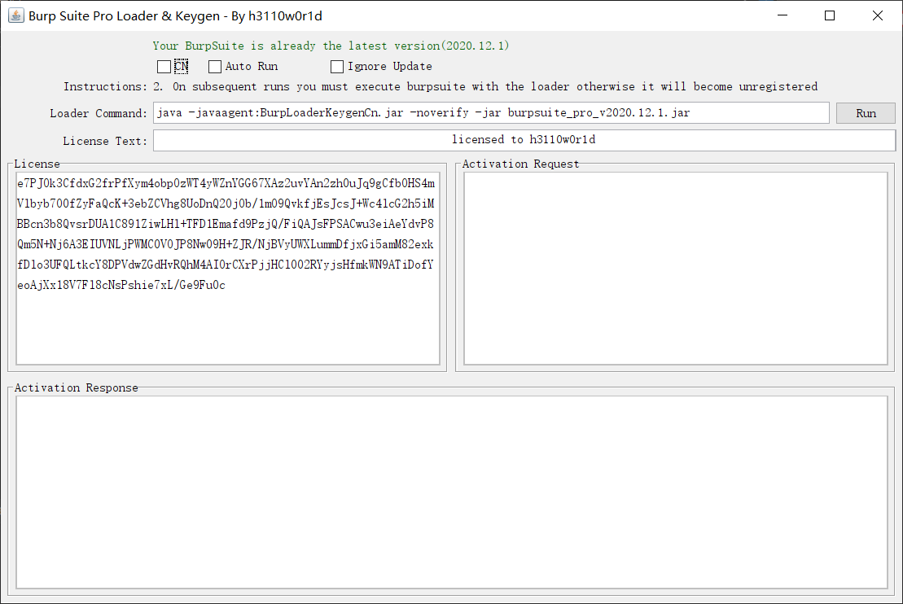

Burp Suite Pro Loader & Keygen ( BurpSuite version v2020.1 - ∞ )

## İndir

***Jar dosyası üzerinde denemeler yapıldı.***

<br>Önerilen
```
https://portswigger.net/burp/releases/download?product=pro&version=2021.3&type=Jar
```
```
Linux (64-bit):		https://portswigger.net/burp/releases/download?product=pro&version=2021.3&type=Linux
```
```
Mac OSX:			https://portswigger.net/burp/releases/download?product=pro&version=2021.3&type=MacOsx
```
```
Windows (64-bit):	https://portswigger.net/burp/releases/download?product=pro&version=2021.3&type=WindowsX64
```
```
Agent Update:		https://portswigger.net/burp/releases/download?product=pro&version=2021.3&type=AgentUpdate77
```

## Talimatlar

Çevresel gereksinimler: Java v9-14 BurpSuite v2020.1-∞

- Çalıştır.

    ```
    java -jar BurpLoaderKeygen.jar
    ```

- Açılan pencereden **Loader Command** kısmında indirdiğiniz jar dosyasını belirtiniz. *(burpsuite_pro_v2020.12.1.jar)*
- Burp kurulumu açıldıktan sonra *Manuel Licence* ile devam edin.
- Gelen pencerede *Activation Request* verisi dolu olarak gelecektir.
Bu veriyi Keygen'deki *Activation Request* içerisine yapıştır.
- Bu işlemden sonra Keygen'de *Activation Response* değeri oluşacaktır. Bu değeri Burp kurulum penceresinde ki *Activation Response* alanı içerisine yapıştırın.



